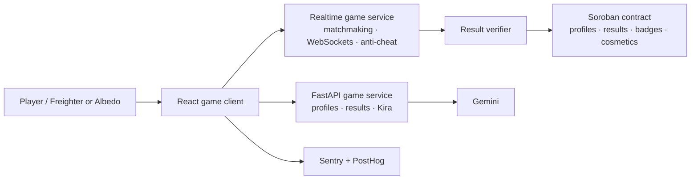

# Stellar Arena: Cosmic Capture

An anime-inspired competitive space game for Stellar. Players collect Stellar Cores, activate tactical abilities, avoid the shrinking void, and build a persistent pilot identity without putting real-time movement on-chain.
## What is in this MVP

- Manga-panel responsive React experience with a generated cosmic key visual, Kyoto orbit, neon city, and winter arena styling.
- Direct, no-wallet Solo Practice: a 90-second local core run with movement controls, ability activation, result screen, and wallet-aware persistence when connected.
- Quest notebook, hidden quest, cosmetic hangar, crew/social page, rankings, badges, flight log, a readable paged manga prologue, and a small Tic-Tac-Toe arcade.
- A responsive 3D hangar bay. It lazy-loads a draggable GLB model when `VITE_HANGAR_MODEL_URL` is configured, keeping the initial web bundle lean.
- Kira, the in-world guide character, with Gemini through a key-safe FastAPI route and safe local fallback answers.
- Real Freighter and Albedo wallet connection flows; no private keys ever enter the application.
- Soroban contract MVP for player profiles, final verified match results, ranking points, and cosmetic ownership.
- PostgreSQL schema and API for player names, wallet identities, local match results, Soroban transaction hashes, and feedback; optional Sentry/PostHog initialization; GitHub Actions CI and Vercel deployment pipeline.

## Deployed Live Link

https://cosmic-capture.vercel.app/

## Admin Panel


## Screenshots of Product


## Mobile Responsive 


## Architecture



Gameplay is intentionally off-chain: movement, collisions, core spawns, and abilities need sub-second response. The server produces a signed/verified final result; only that compact outcome is committed with Soroban.

## Users onboarded

| Timestamp | Name | Email | Stellar wallet address | Rating | Feedback |
| --- | --- | --- | --- | ---: | --- |
| 7/27/2026 0:01:22 | seyit ali değirmen | degirmenseyit@gmail.com | `GDOCMYNNTH62NW37IZCN6BKQTM5Z73RW7OOFXRADLYXUABDN3UXWDTNC` | 5 | Great job, I really liked it. The chess game I noticed at the very end added a nice touch, too. |
| 7/27/2026 0:36:45 | Subhadip Dutta | subhadipduttasubha@gmail.com | `GAVNLCS3GSWLKXSLZ3ITSL7QNB5IGHEOELXAF6QTYACDLEJ7XRQKBBNO` | 5 | Great user interface and smooth experience. The game runs smoothly without issues. |
| 7/27/2026 0:43:16 | Sandipan Singh | alt@sandipansingh.com | `GDYIHXTUKLCPZHWGGD5B5ZPJZINZ3WUNC3PJCDAYEB4XY4LT2XNTQHTX` | 5 | Cool Game!!!! |
| 7/27/2026 13:27:50 | Pritam Mondal | proumg2@gmail.com | `GAEAB4UWRUODGUKBYGDXBZULSOI3HJ6HQKJNNLTY66IF3ATXMRYUCSNX` | 4 | WELL FANTASTIC INSANE |
| 7/27/2026 13:30:21 | RITESH GUPTA | kingofpirates451@gmail.com | `GDFSDPEEBZYQVG5JPPTJUOH4FID4M5XV45BKTWCIEIRYMCWJ6DQADBMB` | 3 | `53d222129692157e20e1e7d3b368c44a132b5ec61f6a85f3a7e9626e0613d934` — transaction bhi kiya hu 😂😂 |
| 7/27/2026 13:31:07 | Ankita | poulumidui@gmail.com | `GCV5X5CKYUAPQLE3OYQS3PDXKX4TRV767YUCJ66PWWGZD2BXE744T276` | 4 | Well played |
| 7/27/2026 13:32:11 | Papita | poppritu@gmail.com | `GACMLTEWZ23NGJ5WZ2THYGLODFYTEKECB7J2U33H3DCSW2PEAQUEIZED` | 5 | UIUX IS AWESOME |
| 7/27/2026 13:37:17 | Rishi Dey | dramitabh101dey@gmail.com | `GBO7BZSNAX6APJW32OE5LHXQZ6MTIHBTWRZZRCJL3VSILWCAZLGCPM4T` | 5 | very good ui and gameplay |
| 7/27/2026 13:49:02 | Amitabh Dey | amitabhdey101@gmail.com | `GBKYHWSL2MNUO73HWY6KWNOA64AKSUENCOBTR56M66HNLMMKMZHK5OAS` | 5 | its nice but the game still need some improvement |
| 7/27/2026 16:49:06 | taro | lucasdory05@gmail.com | `GDNLCRNGYZNS7TQ4K5TPPH7LAIXMPXTLR6GN46VFBJLBKC6DFS24JFAU` | 4 | overall experience pretty smooth. nice work |
| 7/27/2026 17:13:41 | Ankush Shaw | ankushshaw764@gmail.com | `GBBIG4HLPGTLG6BH6YREVWJXEQ4NX74HTD444JD6A6XYS7DOFL2J6DEI` | 5 | really good |
| 7/27/2026 19:34:53 | Nitin Raj | rajnitin793@gmail.com | `GARRE4DTEUJIQSXRACCL6X55RH42S7WBO32F5HB4DU32MT6IL5TL3B3N` | 5 | great work on ui, overall experience is great!! |
| 7/27/2026 19:44:48 | Arijit Debnath | arijitdebnath008@gmail.com | `GDBHMNAQ5CRSNNSHIVJRM3OGMIX3TS3VR2J5SHFUKPGDZDCMBXAVMONK` | 5 | Bolbo na |

## User data spreadsheet

[Open the user data spreadsheet](https://docs.google.com/spreadsheets/d/1ZZj4TlG5uyUBylbOUT6-azJKUIOxFSF_c-opmwFxoGE/edit?usp=sharing)

## Feedback form link

[Open the feedback form](https://forms.gle/JogZinMtuEdXZvK7A)

## Current playable arena

The **Play** route is a 90-second Canvas arena, not a mock-up. Pilot the supplied Sora interceptor with **WASD / arrow keys**, aim with a mouse or touch, and press/hold **Space** or the pointer to fire. Capture luminous Stellar Cores for points, take down rival scouts, and finish above the board to earn a Testnet result. Arena entry requires a connected Freighter or Albedo wallet plus a callsign and age (13+); the prologue, crew files, hangar, shop preview, and arcade remain public. A completed run is sent to FastAPI, which stores the public wallet, profile, match, and Stellar transaction hashes in PostgreSQL.

Each ship has one hull per round: a destroyed player is extracted and a destroyed rival stays out. **Space** now fires as well as pointer/touch input. The **Store** sells Aegis Bloom, Blink Shift, and EMP Bloom using wallet-signed native XLM on Testnet; the FastAPI service verifies the Horizon transaction, stores its receipt in PostgreSQL, and only then equips the module.

First place records a one-time **native XLM Testnet prize** and FastAPI sends it from a server-only winner treasury to the connected wallet. This feature is intentionally Testnet-only: the local Canvas MVP is not an anti-cheat authority and must not be used to release Mainnet value. Duo mode includes a durable, wallet-backed Postgres matchmaking lobby; a separate authoritative WebSocket game service is still required before combat can be synchronized between devices.

## Run locally

Requirements: Node 22+, Python 3.12+, PostgreSQL 16+ (or Docker), a Freighter extension and/or Albedo account for wallet testing, and Rust if you will work on the contract.

```bash
npm install
python -m venv .venv
.\.venv\Scripts\Activate.ps1
pip install -r backend/requirements.txt
Copy-Item .env.example .env
docker compose up -d postgres
npm run db:migrate
npm run dev:full
```

Open `http://localhost:5173`. The client runs on `5173`; the game API runs on `3001`.

Solo Practice needs none of the external keys: click **Play → Launch Solo Practice** and it works entirely in the browser. Connect a wallet and start the API only when you want player and match data persisted to PostgreSQL.

Set `GEMINI_API_KEY` in `.env` to make Kira use Gemini through the API. The key never reaches the browser. Without it, the guide deliberately falls back to local answers so the game remains playable.

## Environment variables

| Variable | Location | Purpose |
| --- | --- | --- |
| `VITE_GAME_API_URL` | frontend | Optional API origin for local development. Leave empty on Vercel to use the same-origin FastAPI Function at `/api`. |
| `VITE_SOROBAN_CONTRACT_ID` | frontend | Stellar Testnet contract ID: `CCPBQGLTWINIHUIAR3G77CIXLDRCRQJB6JGVCTPKVCKG3J25FIKO2XBK`. |
| `VITE_SENTRY_DSN` | frontend | Optional browser error tracking. |
| `VITE_POSTHOG_KEY` | frontend | Optional product analytics. |
| `VITE_POSTHOG_HOST` | frontend | PostHog region endpoint. |
| `VITE_HANGAR_MODEL_URL` | frontend | Public HTTPS URL to a `.glb` asset generated/exported through To3D. Optional. |
| `VITE_STELLAR_HORIZON_URL` | frontend | HTTPS Stellar Testnet Horizon origin, normally `https://horizon-testnet.stellar.org`. Do not append `/api`. |
| `VITE_GAME_ASSET_CODE` | frontend | `ASTRA`. |
| `VITE_GAME_ASSET_ISSUER` | frontend | Project ASTRA Testnet issuer: `GDTHHFGEJKUXSKMFX6HRIDF7S7FN5CSIUFXU7T6K4UOFV7KI5DAT6UJN`. |
| `VITE_POWERUP_TREASURY_ADDRESS` | frontend | Public Stellar Testnet account that receives native-XLM power-up payments. |
| `DATABASE_URL` | server only | PostgreSQL connection URL. Required for the game API. |
| `DATABASE_SSL` | server only | Set `true` for managed Postgres that requires TLS. |
| `DATABASE_POOL_MIN` | server only | Minimum FastAPI/asyncpg connections to keep warm. |
| `DATABASE_POOL_MAX` | server only | PostgreSQL connection pool limit. |
| `GEMINI_API_KEY` | server only | Gemini access key; never expose it as a `VITE_` variable. |
| `GEMINI_MODEL` | server only | Optional Gemini model override. |
| `CLIENT_ORIGIN` | server only | CORS allow-list origin. |
| `PORT` | server only | FastAPI service port, defaults to `3001`. |
| `SOROBAN_RPC_URL` | server only | Stellar Testnet Soroban RPC endpoint used by the result verifier. |
| `STELLAR_GAME_ASSET_ISSUER` | server only | Must match the public ASTRA issuer configured in `VITE_GAME_ASSET_ISSUER`. |
| `STELLAR_REWARD_ISSUER_SECRET` | server only | Private secret for that same funded ASTRA issuer. Never expose it as `VITE_*`. |
| `RESULT_VERIFIER_SECRET` | server only | Secret for the backend-only result-verifier Stellar account. Never commit or prefix with `VITE_`. |
| `ADMIN_ACCESS_TOKEN` | server only | Long random bearer token required by the in-app **Ops** dashboard. It is never sent unless you unlock that dashboard. |
| `STELLAR_POWERUP_TREASURY_ADDRESS` | server only | Must match the public checkout destination; FastAPI verifies XLM payments to this address before granting a power-up. |
| `STELLAR_WIN_REWARD_TREASURY_SECRET` | server only | Secret key for a funded Stellar **Testnet** account that sends a one-time winner prize. Never expose it as `VITE_*`. |
| `STELLAR_WIN_REWARD_AMOUNT` | server only | Native XLM Testnet prize per first-place match; defaults to `1.0000000`. |

The FastAPI service exposes `GET /health`, `GET /api/health`, `GET /api/leaderboard`, and write routes for players, matches, transactions, power-up receipts, feedback, and Kira. It adds CORS, schema validation, connection pooling, safe error responses, and shutdown handling. The migrations store `display_name`, `wallet_address`, match result hashes, Stellar transaction hashes, and verified power-up ownership separately for auditability.

## Deploy on Vercel

This repository now deploys the Vite client and FastAPI API together. `api/index.py` exports the FastAPI app as a Vercel Function, while `vercel.json` keeps `/api/*` requests on that function and routes every other URL to the React SPA.

1. Push the repository to GitHub and import it into Vercel.
2. In **Project Settings → Environment Variables**, add the server-only values from `.env.example`: at minimum `DATABASE_URL`, `DATABASE_SSL=true`, `CLIENT_ORIGIN=https://your-domain.vercel.app`, and the Stellar/Gemini variables you plan to enable.
3. Add the public `VITE_` values there too. Leave `VITE_GAME_API_URL` empty so browser requests use the same Vercel domain. `VITE_POWERUP_TREASURY_ADDRESS` and `STELLAR_POWERUP_TREASURY_ADDRESS` must contain the same funded Stellar Testnet public address. Add `STELLAR_WIN_REWARD_TREASURY_SECRET` only to Vercel's server environment, fund its public account with Testnet XLM, and set `STELLAR_WIN_REWARD_AMOUNT=1.0000000` (or your chosen Testnet amount).
4. Run `npm run db:migrate` once against the production Neon database before enabling checkout, then deploy. The migration now includes player age and the Duo lobby tables. Vercel detects the Vite build and root `requirements.txt` automatically. The Vercel routing configuration explicitly sends `/api/*` to `api/index.py` before the React SPA fallback, so POSTs such as player registration and power-up verification reach FastAPI instead of returning `405` from the static site.

After deployment, set a long random `ADMIN_ACCESS_TOKEN` in Vercel. Open **Ops** in the app header and enter that value to see registered pilots, login activity, matches, purchases, Stellar transaction hashes, XLM prize totals, and feedback. The token stays only in that browser tab session.

For a CLI deploy after linking the project, run `npx vercel deploy --prod`. Vercel documents FastAPI Functions and Vite SPA rewrites in its [FastAPI guide](https://vercel.com/docs/frameworks/backend/fastapi) and [Vite guide](https://vercel.com/docs/frameworks/frontend/vite).

## Stellar wallets

`src/lib/wallets.ts` contains the real wallet connection layer:

- **Freighter** calls `setAllowed()` then `getAddress()` from `@stellar/freighter-api`.
- **Albedo** calls the `publicKey` intent from `@albedo-link/intent`.

Both flows ask the player to approve access in their wallet. The app only retains the public address in browser state. When a deployed contract and result API are connected, use the same wallet adapters to sign registration, badge, and cosmetic transactions.

## Soroban contract MVP

### Deployed contract

- **Network:** Stellar Testnet
- **Contract ID:** [`CCPBQGLTWINIHUIAR3G77CIXLDRCRQJB6JGVCTPKVCKG3J25FIKO2XBK`](https://lab.stellar.org/r/testnet/contract/CCPBQGLTWINIHUIAR3G77CIXLDRCRQJB6JGVCTPKVCKG3J25FIKO2XBK)

The contract source is at [`contracts/stellar-arena/src/lib.rs`](contracts/stellar-arena/src/lib.rs). It supports:

1. Admin initialization.
2. Player self-registration, authenticated by the player wallet.
3. Admin/server-authenticated recording of a unique final match result.
4. Aggregate matches, wins, cores, and ranking points.
5. Admin-gated cosmetic ownership minting.

The deployer should be the result-verifier account, or a narrowly scoped authorization account controlled by the backend. Do not give arbitrary clients permission to call `record_match`.

Local verification:

```bash
cargo fmt --manifest-path contracts/stellar-arena/Cargo.toml -- --check
cargo test --manifest-path contracts/stellar-arena/Cargo.toml
```

To deploy, compile with the Soroban-compatible `wasm32v1-none` target, use the Stellar CLI against Testnet, then place the resulting address in `VITE_SOROBAN_CONTRACT_ID`. A funded Testnet account and the project-specific verifier address are required, so deployment is deliberately not hard-coded here.

## Production checklist

- [x] Responsive frontend with loading, empty, and wallet rejection states.
- [x] Real Freighter and Albedo account-connection code.
- [x] FastAPI + asyncpg API that protects the Gemini key and maintains PostgreSQL pools.
- [x] PostgreSQL migration plus API routes for players, matches, transaction hashes, and feedback.
- [x] Locally playable Solo Practice with no wallet or secret requirement.
- [x] Soroban contract source and CI verification job.
- [x] Sentry and PostHog integration points.
- [x] CI and deployment workflow templates.
- [ ] Deploy the game API + WebSocket server and implement server-side anti-cheat.
- [x] Deploy the contract to Stellar Testnet and add its address to deployment environment variables.
- [ ] Configure Sentry/PostHog project keys and capture screenshots for the review package.
- [ ] Onboard ten real Testnet players and save their consented wallet-interaction evidence.
- [ ] Publish a live demo and record the requested walkthrough video.

## CI/CD

The CI workflow at [`.github/workflows/ci.yml`](.github/workflows/ci.yml) runs on every PR and `master` push. It installs with `npm ci`, lints and builds the Vite client, compiles the FastAPI package using the same root requirements Vercel uses, and formats/tests/builds the Soroban WASM target.

The release workflow at [`.github/workflows/deploy.yml`](.github/workflows/deploy.yml) runs only after a successful `master` CI run (or through manual dispatch). It rebuilds the Soroban WASM, deploys and initializes a fresh Testnet contract, passes that contract ID into the Vercel production build, deploys the exact prebuilt artifact, and verifies `GET /api/health`. It requires these GitHub repository secrets:

- `VERCEL_TOKEN`
- `VERCEL_ORG_ID`
- `VERCEL_PROJECT_ID`
- `STELLAR_CONTRACT_DEPLOYER_SECRET` — funded Stellar **Testnet** `S...` key used only by GitHub Actions to deploy the contract.
- `STELLAR_CONTRACT_ADMIN_ADDRESS` — matching public Stellar `G...` address; it becomes the contract administrator.
- `VITE_SENTRY_DSN` and `VITE_POSTHOG_KEY` (optional)

Configure application runtime secrets (`DATABASE_URL`, Gemini, Stellar payout values, and `ADMIN_ACCESS_TOKEN`) in **Vercel**, not GitHub Actions. The Testnet contract deployer secret belongs only in GitHub Actions because it signs the deployment. The API and browser use the same deployment origin by default. Optional GitHub Environment protection rules on `production` can require your approval before the deployment job starts.

## Project map

```text
src/
  App.tsx                 Product surfaces and game UI
  lib/wallets.ts          Freighter + Albedo connections
  lib/observability.ts    Optional Sentry + PostHog setup
backend/app/main.py       FastAPI game API + Gemini guide endpoint
api/index.py              Vercel FastAPI Function entrypoint
backend/app/schemas.py    Validated API payloads
backend/scripts/migrate.py PostgreSQL migration runner
backend/requirements.txt  Pinned Python service dependencies
db/migrations/            Player, match, transaction, and feedback schema
Dockerfile                Production container for the game API
vercel.json               Vite SPA + same-origin API routing
requirements.txt          Vercel Python dependency entrypoint
contracts/stellar-arena/  Soroban contract MVP
public/art/               Generated project art
.github/workflows/        CI and guarded Vercel deployment
```

## Product notes

Stellar Arena is designed to validate whether players return for fast social matches, rather than speculative reward loops. Track queue conversion, match completion, repeat play, ability selections, and wallet-connect conversion before expanding tokenized rewards.

done
