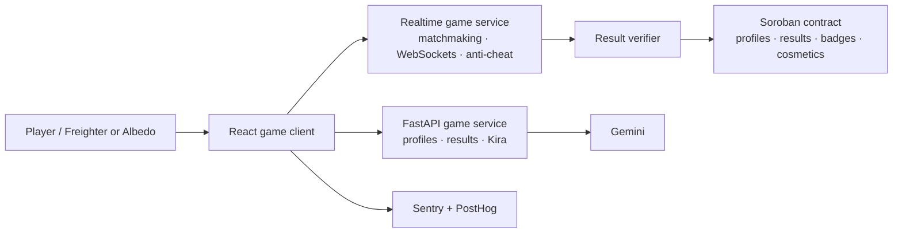

# Stellar Arena: Cosmic Capture

An anime-inspired competitive space game for Stellar. Players collect Stellar Cores, activate tactical abilities, avoid the shrinking void, and build a persistent pilot identity without putting real-time movement on-chain.


## What is in this MVP

- Manga-panel responsive React experience with a generated cosmic key visual, Kyoto orbit, neon city, and winter arena styling.
- Direct, no-wallet Solo Practice: a 90-second local core run with movement controls, ability activation, result screen, and wallet-aware persistence when connected.
- Quest notebook, hidden quest, cosmetic hangar, crew/social page, rankings, badges, flight log, a readable paged manga prologue, and a small Tic-Tac-Toe arcade.
- A responsive 3D hangar bay. It lazy-loads a draggable GLB model when `VITE_HANGAR_MODEL_URL` is configured, keeping the initial web bundle lean.
- Kira, the in-world guide character, with Gemini through a key-safe FastAPI route and safe local fallback answers.
- Real Freighter and Albedo wallet connection flows; no private keys ever enter the application.
- Soroban contract MVP for player profiles, final verified match results, ranking points, and cosmetic ownership.
- PostgreSQL schema and API for player names, wallet identities, local match results, Soroban transaction hashes, and feedback; optional Sentry/PostHog initialization; GitHub Actions CI and Vercel deployment pipeline.

## Architecture



Gameplay is intentionally off-chain: movement, collisions, core spawns, and abilities need sub-second response. The server produces a signed/verified final result; only that compact outcome is committed with Soroban.

## Current playable arena

The **Play** route is a 90-second Canvas arena, not a mock-up. Pilot the supplied Sora interceptor with **WASD / arrow keys**, aim with a mouse or touch, and hold the pointer to fire. Capture luminous Stellar Cores for points, take down rival scouts, and finish above the board to earn an Astra result. A completed wallet-linked run is sent to the FastAPI result API, which stores the wallet, run data, and any later Testnet transaction hash in PostgreSQL. Guest solo runs remain fully playable without a wallet or secrets.

Each ship has one hull per round: a destroyed player is extracted and a destroyed rival stays out. **Space** now fires as well as pointer/touch input. The **Store** sells Aegis Bloom, Blink Shift, and EMP Bloom using wallet-signed native XLM on Testnet; the FastAPI service verifies the Horizon transaction, stores its receipt in PostgreSQL, and only then equips the module.

## Run locally

Requirements: Node 22+, Python 3.12+, PostgreSQL 16+ (or Docker), a Freighter extension and/or Albedo account for wallet testing, and Rust if you will work on the contract.

```bash
npm install
python -m venv .venv
.\.venv\Scripts\Activate.ps1
pip install -r backend/requirements.txt
Copy-Item .env.example .env
docker compose up -d postgres
npm run db:migrate
npm run dev:full
```

Open `http://localhost:5173`. The client runs on `5173`; the game API runs on `3001`.

Solo Practice needs none of the external keys: click **Play → Launch Solo Practice** and it works entirely in the browser. Connect a wallet and start the API only when you want player and match data persisted to PostgreSQL.

Set `GEMINI_API_KEY` in `.env` to make Kira use Gemini through the API. The key never reaches the browser. Without it, the guide deliberately falls back to local answers so the game remains playable.

## Environment variables

| Variable | Location | Purpose |
| --- | --- | --- |
| `VITE_GAME_API_URL` | frontend | Optional API origin for local development. Leave empty on Vercel to use the same-origin FastAPI Function at `/api`. |
| `VITE_SOROBAN_CONTRACT_ID` | frontend | Testnet contract address after deployment. |
| `VITE_SENTRY_DSN` | frontend | Optional browser error tracking. |
| `VITE_POSTHOG_KEY` | frontend | Optional product analytics. |
| `VITE_POSTHOG_HOST` | frontend | PostHog region endpoint. |
| `VITE_HANGAR_MODEL_URL` | frontend | Public HTTPS URL to a `.glb` asset generated/exported through To3D. Optional. |
| `VITE_POWERUP_TREASURY_ADDRESS` | frontend | Public Stellar Testnet account that receives native-XLM power-up payments. |
| `DATABASE_URL` | server only | PostgreSQL connection URL. Required for the game API. |
| `DATABASE_SSL` | server only | Set `true` for managed Postgres that requires TLS. |
| `DATABASE_POOL_MIN` | server only | Minimum FastAPI/asyncpg connections to keep warm. |
| `DATABASE_POOL_MAX` | server only | PostgreSQL connection pool limit. |
| `GEMINI_API_KEY` | server only | Gemini access key; never expose it as a `VITE_` variable. |
| `GEMINI_MODEL` | server only | Optional Gemini model override. |
| `CLIENT_ORIGIN` | server only | CORS allow-list origin. |
| `PORT` | server only | FastAPI service port, defaults to `3001`. |
| `SOROBAN_RPC_URL` | server only | Stellar Testnet Soroban RPC endpoint used by the result verifier. |
| `RESULT_VERIFIER_SECRET` | server only | Secret for the backend-only result-verifier Stellar account. Never commit or prefix with `VITE_`. |
| `STELLAR_POWERUP_TREASURY_ADDRESS` | server only | Must match the public checkout destination; FastAPI verifies XLM payments to this address before granting a power-up. |

The FastAPI service exposes `GET /health`, `GET /api/health`, `GET /api/leaderboard`, and write routes for players, matches, transactions, power-up receipts, feedback, and Kira. It adds CORS, schema validation, connection pooling, safe error responses, and shutdown handling. The migrations store `display_name`, `wallet_address`, match result hashes, Stellar transaction hashes, and verified power-up ownership separately for auditability.

## Deploy on Vercel

This repository now deploys the Vite client and FastAPI API together. `api/index.py` exports the FastAPI app as a Vercel Function, while `vercel.json` keeps `/api/*` requests on that function and routes every other URL to the React SPA.

1. Push the repository to GitHub and import it into Vercel.
2. In **Project Settings → Environment Variables**, add the server-only values from `.env.example`: at minimum `DATABASE_URL`, `DATABASE_SSL=true`, `CLIENT_ORIGIN=https://your-domain.vercel.app`, and the Stellar/Gemini variables you plan to enable.
3. Add the public `VITE_` values there too. Leave `VITE_GAME_API_URL` empty so browser requests use the same Vercel domain. `VITE_POWERUP_TREASURY_ADDRESS` and `STELLAR_POWERUP_TREASURY_ADDRESS` must contain the same funded Stellar Testnet public address.
4. Run `npm run db:migrate` once against the production Neon database before enabling checkout, then deploy. Vercel detects the Vite build and root `requirements.txt` automatically.

For a CLI deploy after linking the project, run `npx vercel deploy --prod`. Vercel documents FastAPI Functions and Vite SPA rewrites in its [FastAPI guide](https://vercel.com/docs/frameworks/backend/fastapi) and [Vite guide](https://vercel.com/docs/frameworks/frontend/vite).

## Stellar wallets

`src/lib/wallets.ts` contains the real wallet connection layer:

- **Freighter** calls `setAllowed()` then `getAddress()` from `@stellar/freighter-api`.
- **Albedo** calls the `publicKey` intent from `@albedo-link/intent`.

Both flows ask the player to approve access in their wallet. The app only retains the public address in browser state. When a deployed contract and result API are connected, use the same wallet adapters to sign registration, badge, and cosmetic transactions.

## Soroban contract MVP

The contract source is at [`contracts/stellar-arena/src/lib.rs`](contracts/stellar-arena/src/lib.rs). It supports:

1. Admin initialization.
2. Player self-registration, authenticated by the player wallet.
3. Admin/server-authenticated recording of a unique final match result.
4. Aggregate matches, wins, cores, and ranking points.
5. Admin-gated cosmetic ownership minting.

The deployer should be the result-verifier account, or a narrowly scoped authorization account controlled by the backend. Do not give arbitrary clients permission to call `record_match`.

Local verification:

```bash
cargo fmt --manifest-path contracts/stellar-arena/Cargo.toml -- --check
cargo test --manifest-path contracts/stellar-arena/Cargo.toml
```

To deploy, compile for `wasm32-unknown-unknown`, use the Stellar CLI against Testnet, then place the resulting address in `VITE_SOROBAN_CONTRACT_ID`. A funded Testnet account and the project-specific verifier address are required, so deployment is deliberately not hard-coded here.

## Production checklist

- [x] Responsive frontend with loading, empty, and wallet rejection states.
- [x] Real Freighter and Albedo account-connection code.
- [x] FastAPI + asyncpg API that protects the Gemini key and maintains PostgreSQL pools.
- [x] PostgreSQL migration plus API routes for players, matches, transaction hashes, and feedback.
- [x] Locally playable Solo Practice with no wallet or secret requirement.
- [x] Soroban contract source and CI verification job.
- [x] Sentry and PostHog integration points.
- [x] CI and deployment workflow templates.
- [ ] Deploy the game API + WebSocket server and implement server-side anti-cheat.
- [ ] Deploy the contract to Testnet; add the address to deployment environment variables.
- [ ] Configure Sentry/PostHog project keys and capture screenshots for the review package.
- [ ] Onboard ten real Testnet players and save their consented wallet-interaction evidence.
- [ ] Publish a live demo and record the requested walkthrough video.

## CI/CD

The CI workflow at [`.github/workflows/ci.yml`](.github/workflows/ci.yml) builds/lints the frontend and checks/tests the Soroban contract for every PR and `main` push.

The Vercel workflow at [`.github/workflows/deploy.yml`](.github/workflows/deploy.yml) only deploys after these repository secrets exist:

- `VERCEL_TOKEN`
- `VERCEL_ORG_ID`
- `VERCEL_PROJECT_ID`
- `VITE_SENTRY_DSN` and `VITE_POSTHOG_KEY` (optional)

Configure the application runtime secrets in Vercel itself; the API and browser use the same deployment origin by default.

## Project map

```text
src/
  App.tsx                 Product surfaces and game UI
  lib/wallets.ts          Freighter + Albedo connections
  lib/observability.ts    Optional Sentry + PostHog setup
backend/app/main.py       FastAPI game API + Gemini guide endpoint
api/index.py              Vercel FastAPI Function entrypoint
backend/app/schemas.py    Validated API payloads
backend/scripts/migrate.py PostgreSQL migration runner
backend/requirements.txt  Pinned Python service dependencies
db/migrations/            Player, match, transaction, and feedback schema
Dockerfile                Production container for the game API
vercel.json               Vite SPA + same-origin API routing
requirements.txt          Vercel Python dependency entrypoint
contracts/stellar-arena/  Soroban contract MVP
public/art/               Generated project art
.github/workflows/        CI and guarded Vercel deployment
```

## Product notes

Stellar Arena is designed to validate whether players return for fast social matches, rather than speculative reward loops. Track queue conversion, match completion, repeat play, ability selections, and wallet-connect conversion before expanding tokenized rewards.
